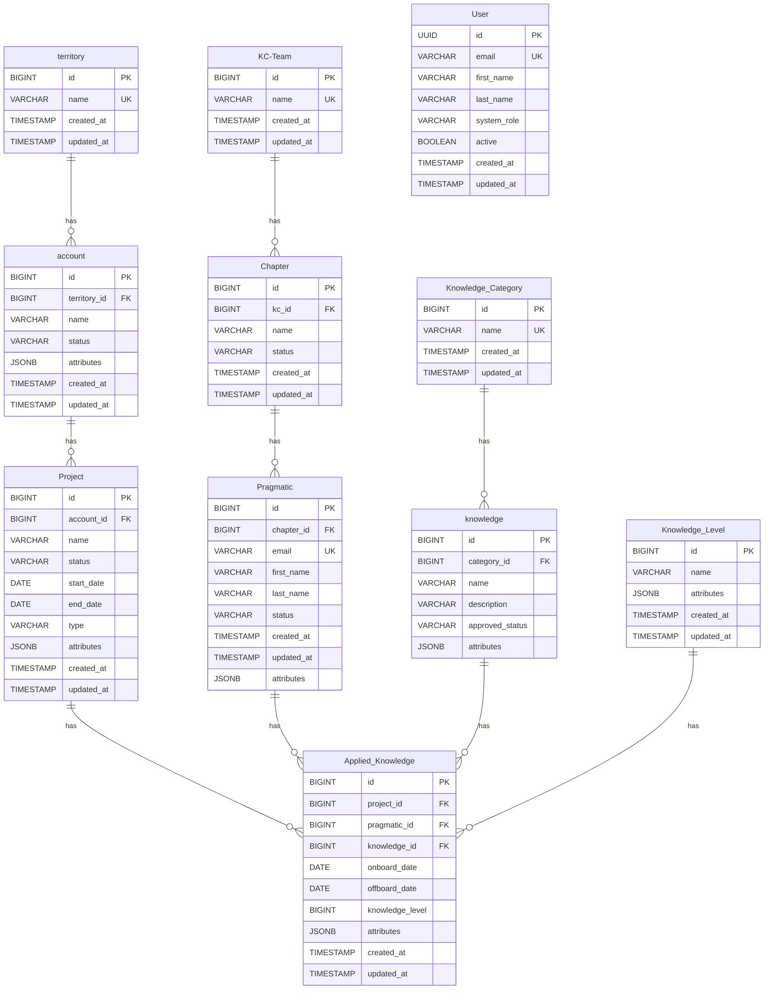

# Knowledge Tracker - Entity Relationship Diagram

This diagram was auto-generated from `src/main/resources/sql/Data_Model.sql`

## ER Diagram

## Tables Overview

### territory
- **Columns**: 4
- **Foreign Keys**: 0

### KC-Team
- **Columns**: 4
- **Foreign Keys**: 0

### Knowledge_Category
- **Columns**: 4
- **Foreign Keys**: 0

### Knowledge_Level
- **Columns**: 5
- **Foreign Keys**: 0

### User
- **Columns**: 8
- **Foreign Keys**: 0

### account
- **Columns**: 7
- **Foreign Keys**: 1
- **References**:
  - `territory_id` → `territory`

### Chapter
- **Columns**: 6
- **Foreign Keys**: 1
- **References**:
  - `kc_id` → `KC-Team`

### knowledge
- **Columns**: 6
- **Foreign Keys**: 1
- **References**:
  - `category_id` → `Knowledge_Category`

### Project
- **Columns**: 10
- **Foreign Keys**: 1
- **References**:
  - `account_id` → `account`

### Pragmatic
- **Columns**: 9
- **Foreign Keys**: 1
- **References**:
  - `chapter_id` → `Chapter`

### Applied_Knowledge
- **Columns**: 10
- **Foreign Keys**: 4
- **References**:
  - `project_id` → `Project`
  - `pragmatic_id` → `Pragmatic`
  - `knowledge_id` → `knowledge`
  - `knowledge_level` → `Knowledge_Level`
